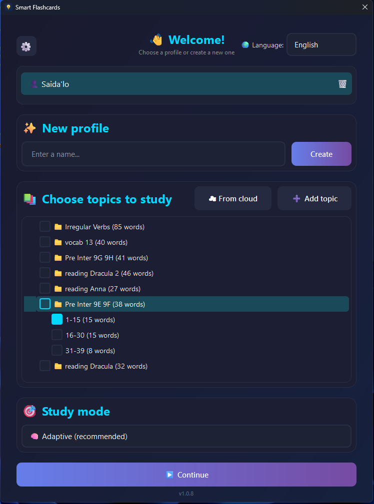
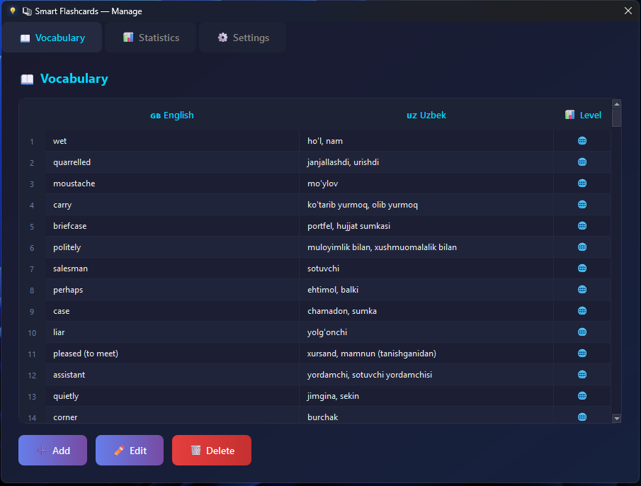

# Smart Flashcards

A desktop app for learning vocabulary that doesn't mark you wrong for a typo or a synonym.



Most flashcard apps grade you like a strict teacher: one wrong letter and the whole card
is "incorrect". That always annoyed me, so the grading here is closer to how a person would
check you — if the meaning is right, it counts.

## Why it's a bit different

When you type an answer, it isn't compared letter-by-letter. Two things happen:

1. A small language model (sentence-transformers) turns your answer and the expected one into
   vectors and compares their meaning, so a close synonym is accepted.
2. If that's inconclusive, [rapidfuzz](https://github.com/rapidfuzz/RapidFuzz) does a fast fuzzy
   check, so a one-letter typo still passes.

Everything runs locally — the model ships with the app, so grading works offline.


*Typing "queitly" still counts as "quietly".*

## What it does

- Review words in a few modes (multiple choice, typing) with the smart grading above.
- Tracks your progress per word — mastery level and streaks, not just a raw score.
- Multiple profiles, so more than one person can use the same install.
- Import and export your vocabulary as an Excel file.
- Download ready-made topic packs from a small online catalog.
- Global hotkeys, so you can flip a card without switching windows (works on Windows and Linux).
- Interface in English, Russian and Uzbek.
- Updates itself — it checks for a new release on startup and installs it in place.



## Install

**Windows:** grab the latest installer from the [Releases](https://github.com/Saidalo1/smart_flashcards_dist/releases)
page and run it. After that it keeps itself up to date.

**From source** (Windows or Linux):

```bash
git clone https://github.com/Saidalo1/smart_flashcards.git
cd smart_flashcards
python -m venv .venv
# Windows: .venv\Scripts\activate    Linux: source .venv/bin/activate
pip install -r requirements.txt
python main.py
```

Python 3.11+ is recommended.

## Built with

- **PySide6** for the interface (the project started on PyQt6 and was moved over).
- **sentence-transformers** + **rapidfuzz** for answer grading.
- **openpyxl** for Excel import/export, **Pillow** for the tray icon.
- **Nuitka** to build the binary, **Inno Setup** for the Windows installer.

## License

GPL-3.0 — see [LICENSE](LICENSE). You're free to use and change it, but derivative work has to
stay open source too.
